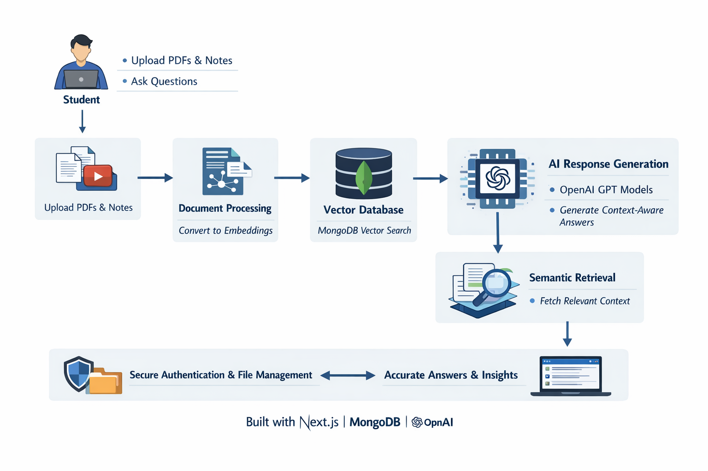

# Lernova 🤖 (AI Atudent Study Assistant)
Lernova is an AI-powered learning platform where students can upload PDFs or notes and ask questions through a chat interface. It uses embeddings and GPT models to retrieve relevant content and generate accurate, context-aware answers.

## 🌐 Live Demo :
- Visit Project at - https://lernova-flax.vercel.app/

## 🏗️ Architecture :

## 🚀 Feature :
- Upload and manage personal PDFs
- Context-aware “Ask AI” question answering
- Getting well Structured Answers
- Delete unwanted PDF / Chat
- Clean and responsive modern UI
- Modular architecture designed for scalability

## 🛠️ Tech Stack
### Frontend
- Next.js (App Router)
- React
- Tailwind CSS
- Framer Motion
- Lenis
### Backend
- Next.js Server Actions
- Node.js runtime
### Database
- MongoDB
### AI Integration
- OpenAI API (Q&A)
